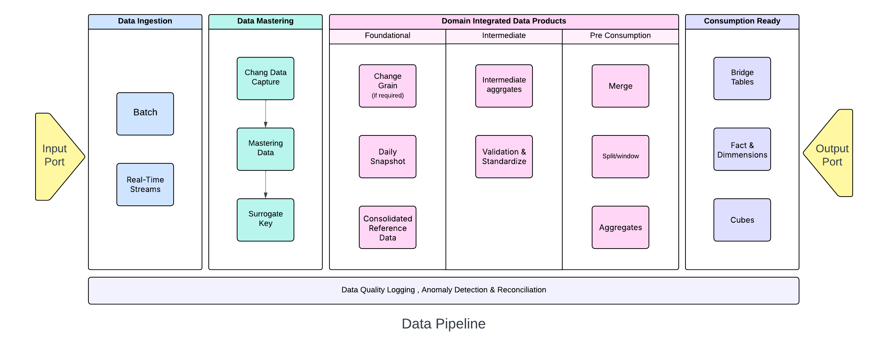

# Data Products Platform Blueprint

This article is based on my experience of building data products platforms where I witnessed how turning data into modular, reusable products can be a true driver of enterprise transformation.

## Why do we need Data Products

The main reason for building data products is the prevalence of data silos and legacy systems, which hinder seamless data integration and limit the potential of analytics projects across the enterprise. The lack of robust data governance can lead to fragmented and unreliable data, making it difficult to generate accurate and actionable insights. 

The aim of data platform should be to reduce the complexity of these systems and their associated costs, through standardization, abstraction and automation.The modularization of the architecture allows for a reduction in complexity and, consequently, the cognitive load on the teams. Data products is that unit of modularization. In later sections, we will briefly touch on what a data product needs. A data product comprises data, metadata, interfaces, transformations, quality checks, governance, and user experience packaged for reliable consumption.

## The Challenge

The main challenge in adopting data products is the need for a significant cultural shift, technical complexity and organizational silos. The adoption of data products can also be hindered by resistance to change, which can be addressed by involving users in the implementation process and emphasizing the benefits of the new system.

## Foundational and Integrated Data Products
Foundational data products are the building blocks whose goal is to expose high-quality data in its pure form to support the development of other applications (integrated/consumer ready data products). They are close to the source system and focus on single domain ownership. They aim to expose data to support multiple use cases, both of analytical and transactional nature. Their value is greater when the data is of high quality, easily accessible, and reusable over time. A foundational data product is a unit of modularization within the data architecture that can be managed independently during its life cycle. 

Integrated data products are higher-level assets created by combining multiple foundational products. They serve specific business needs by delivering cross-domain insights and analytics-ready datasets.

Overall data products promote four key characteristics identified by the acronym FAIR, which stands for findability, accessibility, interoperability, and reusability, intending to maximize the utility of data, promote collaboration, and foster the advancement of knowledge and innovation.

## Data Product Metadata

The metadata associated with data product goes beyond describing the exposed data; they provide a comprehensive description of the product as a whole. Metadata describing a data product (e.g., identifier, name, domain, owner, purpose, etc.), its interfaces (APIs, service levels, usage terms, etc.), and the exposed data (schema, constraints, semantics, etc.) are public.

On the other hand, metadata describing its internal components (applications and infrastructure) are private. In other words, they are visible only to the product team and potentially to the tools used to automate the product life cycle management.

## Application and Infrastructure

A data product is also composed of applications and infrastructural resources. The applications implement the necessary business logic to transform the data (data pipelines) and, more generally, to provide all the services exposed by a pure data product through its interfaces.

## Interfaces

A pure data product provides data and functionality to outside users through **interfaces**, allowing them to use the product without needing to understand its internal workings. The main purpose is to share one or more data assets with potential users, encouraging them to be reused and combined with other products.

Data products communicate through different types of ports, each with a specific function.

- **Input Ports**: These ports define how the data product receives data. It specifies the source (e.g., from other data products or external systems) and the method for acquiring the data, which the product then processes and shares with its users.

- **Output Ports**: These ports are what the data product uses to share its data with users. They describe the specific **data assets** and the **APIs** consumers can use to access them. By using output ports, a data product can manage how its data is used, preventing direct access to its underlying storage.

- **Discoverability Ports**: These ports expose the product's **metadata** (data about the data) through APIs. This allows users to find and understand the product. Some of these ports and their APIs are standardized across all products to ensure they can easily work together.

- **Control Ports**: These ports allow you to change the product's behavior while it's running. For example, you can use them to set the data refresh rate or turn the product on or off. The APIs for these commands are typically standardized, and while they are specified in the product's documentation, they're generally not available to consumers.

- **Monitoring & Observability Ports**: These two types of ports work together to provide insight into the product's health and operational status.
  - **Monitoring ports** provide real-time information about the operational status of all application and infrastructure components within the data product.
  - **Observability ports** gather signals generated by the product to give a deeper look into its internal state, effectively enabling the product's monitoring capabilities.

## Managing the Data Product Marketplace

A key function of the platform is to support the use of released data products through a **marketplace**. This marketplace should provide a user-friendly catalog of all available data products.

The catalog acts as a central hub, offering clear visibility into the **data product portfolio** and the relationships between products. It displays crucial information for users, including:

- The **development teams** responsible for each product.
- The **business cases** the products are designed to support.
- The specific **physical assets** exposed by each product.
- The **concepts in the defined ontologies** that the products reference.

This comprehensive overview enables users to easily discover and understand how different data products connect and what purpose they serve.

## Source-Aligned vs. Consumer-Aligned Data Products

Data products can be classified based on their function within a data architecture.

- **Source-Aligned Data Products**: These products act as the initial point of entry for data. They pull data from external systems and perform simple, **syntactic transformations** to make the data easy for other products to use. They don't apply complex business logic; their main job is to prepare the raw data for the next step.

- **Consumer-Aligned Data Products**: These products read data exclusively from other data products. They **enrich the data** and apply complex business logic to make it useful for specific business use cases. They are the final products that get data ready for end-users or applications.

**Intermediate Aggregated Data Products**: These products sit between the source-aligned and consumer-aligned products. They are used to **change the grain of information**—for example, by aggregating or summarizing data—before it is passed on to a consumer-aligned product.

## Domain-Aligned vs. Value Stream-Aligned Data Products

Data products can also be categorized by the business area they serve.

- **Domain-Aligned Data Products**: Most data products are aligned with a specific **business domain** like marketing, sales, or HR. They only use data from within their own domain, ensuring the data stays relevant to that business function.

- **Value Stream-Aligned Data Products**: These products support use cases that span **multiple business domains**. Instead of focusing on a single function, they support processes that cut across the entire organization, such as "Order to Cash" or "Customer Management." This makes their data valuable for a wider, more global audience.

## Stages of a Data Pipeline

A typical data pipeline progresses through several key stages:

### Data Ingestion

This is the first step where raw data is collected from source systems. This data, which serves as the "building blocks" of data products, can be ingested in **batch files** or **real-time streams**. The data is then stored in a central repository, often a **lakehouse**. The incoming data can be a **full snapshot** (all data), a file with deletes or change flags, a file with only deltas, or a file with only new inserts.

### Data Mastering

Once in the lakehouse, the data undergoes a process called **Change Data Capture (CDC)** to identify which records are new inserts, updates, or deletes. Using this information, a **Slowly Changing Dimension Type 2 (SCD2)** is applied, which tracks the history of each record by assigning **effective and expiry dates**. A **surrogate key**—a unique, system-generated identifier—is also created for each record to ensure stability and improve performance. This mastered data, complete with its history and unique keys, becomes the foundational source for building data products.

### Build Domain Integrated Data Products

The mastered source data may not be at the same level of detail, or "grain," needed for the foundational data products. If needed, the data is **aggregated** to the correct grain. This aggregated data along with mastered data is then used to create a **daily snapshot** of foundational data product. A data product can represent an **event** (like daily transactions) or an **entity** (like a customer). An entity product consolidates data from multiple events or other entities within a domain. At this stage, various transformations are applied to enrich the data.

The daily snapshots from multiple foundational products are combined and aggregated for counts and amounts. These can then be merged into building LTD and time series grains. This is where windowing functions are used to calculate the cumulative totals.The result is an aggregate data product that provides historical and cumulative context for a business domain.

Reference data is also integrated into reference domain that is later use to decode codes or key values during consumption or reporting.

### Consumption/Presentation Layer
**Bridge tables** are created to establish relationships between data, which is then used to build fact and dimension tables for data marts. This prepares the data for specific business intelligence (BI) and reporting needs. Data cubes can also be built from these data products. The resulting data assets provide not just raw information but also valuable context through metadata. This metadata, represented by ontologies and a knowledge graph, can be used to unlock deeper insights and power intelligent applications.

## Data Transformation

**Data transformation** is the central process in a data pipeline that converts raw, often messy, data into a clean, unified, and business-ready format. It's the "kernel" of the data product engine. Key transformation activities include:

- **Decoding**: Converting cryptic source codes (e.g., "MKT_201" to "Summer Marketing Campaign").
- **Decomposition**: Splitting combined data into separate, fundamental components (e.g., "Full Name" into "First Name" and "Last Name").
- **Standardization**: Unifying data content from various systems, including legacy platforms, to ensure consistency and comparability.
- **Summarization**: Rolling up detailed, granular data into higher-level summaries (e.g., daily transactions into a monthly or yearly account summary).

## Data Validation

**Data validation** is a crucial phase that ensures the integrity, accuracy, and quality of the transformed data. This process prevents common errors and maintains data reliability. The validation process includes:

- **Structure Validation**: This step verifies that the relationships between data tables are correct. It checks that tables join when they're supposed to and don't join when they shouldn't, preventing data duplication or invalid associations.

- **Element Validation**: It ensures that individual data fields are only populated when the information is relevant. For example, a "Middle Name" field should be empty if a person doesn't have one.

- **Data Class Validation**: This check confirms that data conforms to its expected type or format (e.g., a Social Security Number is in the correct format, a ZIP code contains only numbers).

- **Range and Consistency Checks**: This involves validating values against predefined numeric ranges, lists of allowed values, and logical rules across multiple fields. For example, a "Date of Birth" field must make logical sense relative to a "Hire Date."

All data quality issues identified during validation are centrally logged and monitored, providing a clear record of data health.

Data quality checks and anomaly detection are essential processes for ensuring the reliability of data throughout its lifecycle.

#### Other Data Quality Checks

- **Completeness**: Checks for missing data. For example, ensuring that a "customer email" field is never empty.
- **Uniqueness**: Identifies and flags duplicate records. For instance, making sure each customer ID is unique within a dataset.
- **Timeliness**: Verifies that data is current and up-to-date, reflecting the most recent information. An example is confirming that a sales report includes data from the previous day.
- **Consistency**: Ensures that data is consistent across different datasets or systems. For instance, a customer's address should be the same in both the sales database and the billing system.

#### Data Reconciliation

**Data reconciliation** is a specific type of data quality check that verifies data consistency and accuracy across different sources or layers of a pipeline. It involves comparing data sets to ensure they match. This process helps to:

- Confirm that data has been moved from a source to a target without loss or corruption.
- Ensure that aggregations and transformations are correct.
- Prevent discrepancies from accumulating as data moves through the pipeline.

#### Anomaly Detection

**Anomaly detection** is a "black box" method for monitoring data quality. Instead of using specific rules, it uses machine learning and statistical models to automatically identify data points that deviate significantly from expected patterns. This technique is often applied to metrics exposed through a product's **observability ports**. These metrics might include:

- The **volume of data** loaded (e.g., a sudden, unexpected drop in daily records).
- The **statistical distribution** of a field (e.g., the average value of a product suddenly skyrockets).
- The **last update time** (e.g., the data hasn't been refreshed as scheduled).

Anomaly detection can catch unexpected data issues that might be missed by standard, rule-based quality checks.

## Utility Plane

In a data products platform, the **Control Plane**, **Data Plane**, and **Utility Plane** work together to manage the full lifecycle of data products. While the Control Plane manages the internal lifecycle and governance, and the Data Plane serves as the platform's "muscle" where data is stored and processed, this section will focus on the equally important, yet less discussed, **Utility Plane**.

The Utility Plane provides standardized, reusable services for interacting with external systems, ensuring consistency and efficiency across the entire platform.

Key capabilities include:

- **Command Execution**: This allows the platform to execute commands on external applications and monitor their progress. For example, it can trigger a CI/CD pipeline, grant permissions, or create a support ticket.

- **Event Notification**: This capability enables the platform to send information to an external service when a specific event occurs, such as a new data product being released. This can be used to automatically update an external data catalog.

- **Policy Validation**: The platform uses this to verify that a resource complies with internal policies. It can connect to external policy engines like Open Policy Agent (OPA) to perform checks.

- **Signals Aggregation**: This capability collects and aggregates signals (like logs, metrics, and traces) from external systems, providing a centralized view of a product's operational health.

- **Configuration Management**: This allows the platform to read, create, and modify configurations in external systems, such as retrieving secrets from a secure vault.

## Integrating Legacy Systems with Pseudo-Data Products

Dealing with legacy data systems during a data-as-a-product migration is common. Instead of a risky "big-bang" migration, an incremental approach is better. This strategy involves isolating and then gradually refactoring legacy systems based on actual business needs.

The first step is to **isolate** legacy systems to protect new data products from their complexities. You can do this using **pseudo-data products**.

- A pseudo-data product acts as an abstraction layer, exposing data from a legacy system in a way that conforms to the new data-as-a-product paradigm (e.g., it uses ports and descriptor documents).

- Downstream data products access the legacy system only through these pseudo-data products, not directly.

- Functionally, a pseudo-data product is similar to a source-aligned data product, but it doesn't require moving data. It simply provides a new interface for old data.

- It's crucial to clearly identify these pseudo-data products because they lack the agility and evolvability of true data products.

- Once a legacy system is isolated, next time a new business case needs a change to a pseudo-data product, you take the opportunity to transform it into a **real data product**.

- This involves moving the data management logic from the legacy system to the new, true data product.

- The key principle is that **no new development occurs on the legacy system**. Over time, as new business needs arise, the data and logic will be incrementally "strangled" out of the old system and into the new architecture. Eventually, the legacy system will be completely empty and can be safely decommissioned.

This incremental, business-driven approach minimizes risk and ensures that the migration delivers value at every step.

## From Data Products to Knowledge Graph: Unlocking Intelligence

Data products are the foundation for building a knowledge graph and unlocking intelligence. This process goes beyond simply providing raw data by adding context, knowledge, and relationships.

*1: Contextualize with Metadata*

Data products don't just expose raw data; they present **contextualized information** through metadata. This metadata provides essential details about the data, such as its source, format, and meaning, making it much more useful than a simple dataset.

*2: Add Domain Knowledge with Ontologies*

The real power comes from linking data products to a **conceptual model**. This model, often formalized as a **domain or enterprise ontology**, provides a shared understanding of the business domain. It defines concepts, terms, and their relationships, giving the data a rich, semantic context. Data products are designed to explicitly connect their exposed data to these ontology concepts.

*3: Build the Knowledge Graph*

A **knowledge graph** is created by connecting the data from a data product to the concepts in an ontology. It links these two planes—the **data plane** (the actual data) and the **knowledge plane** (the ontology)—using the metadata from the **information plane**. This process transforms fragmented data into a cohesive, interconnected network of knowledge.

*4: Unlock Intelligence*

The final result is **intelligence**, defined as the ability to leverage this structured data and knowledge to make smarter decisions. By linking data products to a knowledge graph, organizations can:

- Gain a unified, enterprise-wide view of their data.
- Perform complex analysis based on semantic relationships.
- Power advanced applications that can reason and infer new insights.

 
We've only just scratched the surface of what it takes to build a robust data products platform. This is a complex, multi-year transformation effort that touches technology, culture, and business strategy. I hope this discussion has given you a valuable insight into the principles, components, and long-term vision required to move from treating data as a byproduct to managing it as a strategic asset. The journey is challenging, but the payoff—a truly data-driven organization capable of unlocking intelligence and creating new value—is well worth the effort.
